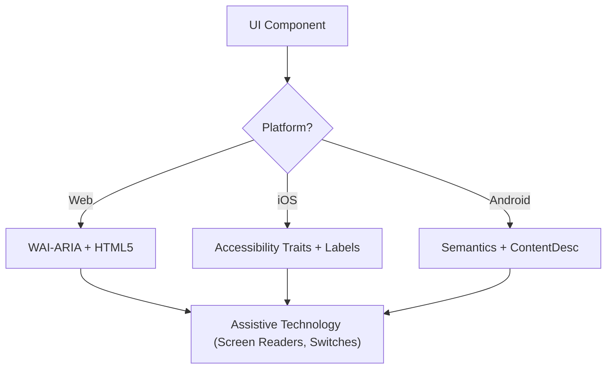

Traducción al español (es).
<!-- translator: OpenCode translation; date: 2026-05-28 -->
# Accesibilidad (WCAG 2.2)

Esta habilidad garantiza que las interfaces digitales sean perceptibles, operables, comprensibles y robustas (POUR) para todos los usuarios, incluidos aquellos que utilizan lectores de pantalla, controles de interruptor o navegación con teclado. Se centra en la implementación técnica de los criterios de éxito de las WCAG 2.2.

## Cuándo utilizar

- Definición de especificaciones de componentes de UI para Web, iOS o Android.
- Auditar el código existente para detectar barreras de accesibilidad o brechas de cumplimiento.
- Implementación de nuevos estándares WCAG 2.2 como Tamaño objetivo (mínimo) y Apariencia de enfoque.
- Mapeo de requisitos de diseño de alto nivel con atributos técnicos (roles ARIA, rasgos, sugerencias).

## Conceptos básicos

- **Principios POUR**: La base de WCAG (Perceptible, Operable, Comprensible, Robusto).
- **Mapeo semántico**: uso de elementos nativos sobre contenedores genéricos para proporcionar accesibilidad integrada.
- **Árbol de accesibilidad**: la representación de la interfaz de usuario que las tecnologías de asistencia realmente "leen".
- **Gestión de enfoque**: Controlar el orden y la visibilidad del cursor del teclado/lector de pantalla.
- **Etiquetado y sugerencias**: proporciona contexto a través de `aria-label`, `accessibilityLabel` y `contentDescription`.

## Cómo funciona

### Paso 1: Identificar la función del componente

Determine el propósito funcional (por ejemplo, ¿es un botón, un enlace o una pestaña?). Utilice el elemento nativo más semántico disponible antes de recurrir a roles personalizados.

### Paso 2: Definir los atributos perceptibles

- Asegúrese de que el contraste del texto cumpla con **4.5:1** (normal) o **3:1** (grande/UI).
- Agregue alternativas de texto para contenido que no sea de texto (imágenes, íconos).
- Implementar reflujo responsivo (hasta un 400% de zoom sin pérdida de función).

### Paso 3: Implementar controles operables

- Garantizar un tamaño de destino mínimo de **24x24 píxeles CSS** (WCAG 2.2 SC 2.5.8).
- Verificar que todos los elementos interactivos sean accesibles mediante el teclado y tengan un indicador de enfoque visible (SC 2.4.11).
- Proporcionar alternativas de un solo puntero para movimientos de arrastre.

### Paso 4: Garantizar una lógica comprensible

- Utilice patrones de navegación consistentes.
- Proporcionar mensajes de error descriptivos y sugerencias de corrección (SC 3.3.3).
- Implementar "Entrada redundante" (SC 3.3.7) para evitar solicitar los mismos datos dos veces.

### Paso 5: Verificar la compatibilidad sólida

- Utilice patrones `Name, Role, Value` correctos.
- Implementar `aria-live` o regiones en vivo para actualizaciones de estado dinámicas.

## Diagrama de arquitectura de accesibilidad


## Mapeo multiplataforma

| Característica | Web (HTML/ARIA) | iOS (SwiftUI) | Android (Redactar) |
| :----------------- | :---------------------- | :----------------------------------- | :---------------------------------------------------------- |
| **Etiqueta principal** | `aria-label` / `<label>` | `.accessibilityLabel()` | `contentDescription` |
| **Pista secundaria** | `aria-describedby` | `.accessibilityHint()` | `Modifier.semantics { stateDescription = ... }` |
| **Rol de acción** | `role="button"` | `.accessibilityAddTraits(.isButton)` | `Modifier.semantics { role = Role.Button }` |
| **Actualizaciones en vivo** | `aria-live="polite"` | `.accessibilityLiveRegion(.polite)` | `Modifier.semantics { liveRegion = LiveRegionMode.Polite }` |

## Ejemplos

### Web: Búsqueda Accesible

```html
<form role="search">
  <label for="search-input" class="sr-only">Search products</label>
  <input type="search" id="search-input" placeholder="Search..." />
  <button type="submit" aria-label="Submit Search">
    <svg aria-hidden="true">...</svg>
  </button>
</form>
```
### iOS: botón de acción accesible

```swift
Button(action: deleteItem) {
    Image(systemName: "trash")
}
.accessibilityLabel("Delete item")
.accessibilityHint("Permanently removes this item from your list")
.accessibilityAddTraits(.isButton)
```
### Android: Alternar accesible

```kotlin
Switch(
    checked = isEnabled,
    onCheckedChange = { onToggle() },
    modifier = Modifier.semantics {
        contentDescription = "Enable notifications"
    }
)
```
## Antipatrones a evitar

- **Botones Div**: uso de `<div>` o `<span>` para un evento de clic sin agregar una función ni compatibilidad con teclado.
- **Significado de solo color**: indica un error o estado _solo_ con un cambio de color (por ejemplo, convertir un borde en rojo).
- **Enfoque modal no contenido**: modales que no atrapan el foco, lo que permite a los usuarios del teclado navegar por el contenido en segundo plano mientras el modal está abierto. El foco debe estar contenido _y_ evitable mediante la tecla `Escape` o un botón de cierre explícito (WCAG SC 2.1.2).
- **Texto alternativo redundante**: uso de "Imagen de..." o "Imagen de..." en texto alternativo (los lectores de pantalla ya anuncian la función "Imagen").

## Lista de verificación de mejores prácticas

- [ ] Los elementos interactivos cumplen con el tamaño objetivo **24x24px** (Web) o **44x44pt** (Nativo).
- [ ] Los indicadores de enfoque son claramente visibles y de alto contraste.
- [] Los modales **contienen el foco** mientras están abiertos y lo sueltan limpiamente al cerrar la tecla (`Escape` o el botón de cerrar).
- [] Los menús desplegables y menús restauran el foco en el elemento activador al cerrar.
- [] Los formularios proporcionan sugerencias de errores basadas en texto.
- [ ] Todos los botones de solo íconos tienen una etiqueta de texto descriptivo.
- [] El contenido se redistribuye correctamente cuando se escala el texto.

## Referencias

- [WCAG 2.2 Guidelines](https://www.w3.org/TR/WCAG22/)
- [WAI-ARIA Authoring Practices](https://www.w3.org/TR/wai-aria-practices/)
- [iOS Accessibility Programming Guide](https://developer.apple.com/documentation/accessibility)
- [iOS Human Interface Guidelines - Accessibility](https://developer.apple.com/design/human-interface-guidelines/accessibility)
-[Android Accessibility Developer Guide](https://developer.android.com/guide/topics/ui/accessibility)

## Habilidades relacionadas

- `frontend-patterns`
- `design-system`
- `liquid-glass-design`
- `swiftui-patterns`